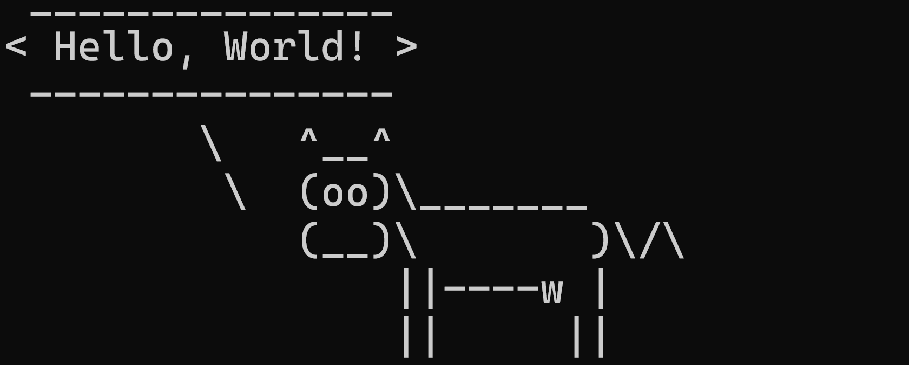

<!-- </img> -->

<h2 align="left"> Hello! I'm Leo Dominick.</h2>

- 💻 I’m currently working as a Cloud Tools Engineer.
- 📫 Email: ldmagpantay@proton.me
- 👔 LinkedIn: [https://www.linkedin.com/in/ldmagpantay/](https://www.linkedin.com/in/leodominickmagpantay/)
- 💻 Tech Stacks: Python, Git, Jenkins, Docker, Kubernetes, Terraform, Cloud Services (AWS, Azure), Linux
